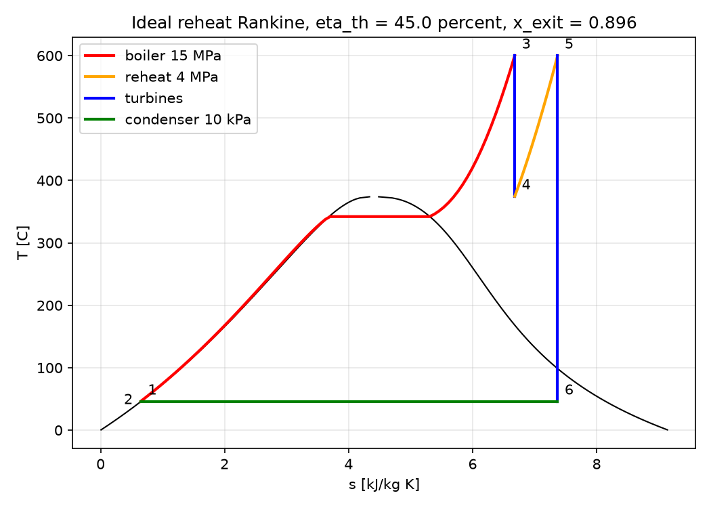

# thermohx: validated thermodynamics and heat transfer solvers

Most solver libraries hand you a number and leave you to trust it. This one keeps its references close, because a correlation you can't trace back to a textbook value turns into a liability the first time someone asks where the number came from. It covers the core of an undergraduate thermo and heat transfer sequence, so the power and refrigeration cycles run on real fluid data through CoolProp, and extended surfaces, heat exchanger sizing and rating, and transient conduction all come with lumped and finite difference solutions checked against the exact series. Convection correlations warn you when you wander outside their fitted range, and they raise on inputs that make no physical sense instead of handing back something that merely looks reasonable. Every module carries at least one textbook validation case in its docstrings, and the test suite checks those numbers. Nothing here is validated by eye.



## API overview

| Module | Functions | Notes |
|---|---|---|
| `thermohx.cycles` | `rankine`, `rankine_reheat`, `rankine_regenerative_open_fwh`, `rankine_reheat_open_fwh`, `brayton`, `vapor_compression`, `saturation_dome` | CoolProp properties with isentropic efficiencies for turbine, pump and compressor, regenerator effectiveness for Brayton, and superheat and subcooling for the refrigeration cycle. Returns eta_th, back work ratio, specific work, COP and the state points. Impossible inputs such as a reversed pressure order, an efficiency outside its bounds, a compressed liquid at the turbine inlet or a regenerator asked to move heat the wrong way raise a ValueError with a plain message. |
| `thermohx.fins` | `rectangular_fin`, `pin_fin`, `efficiency_curve` | Adiabatic tip, exact convective tip and corrected length tip. Returns efficiency, effectiveness, heat rate, m and mL. Degenerate geometry raises. |
| `thermohx.hx` | `lmtd`, `correction_factor_F`, `effectiveness`, `ntu_from_effectiveness`, `max_effectiveness`, `size`, `rate` | Parallel, counterflow, shell and tube 1 to 2, and crossflow with both streams unmixed. `size` returns area from a duty and `rate` returns outlets from UA. Requesting an effectiveness beyond the arrangement limit raises. |
| `thermohx.transient` | `lumped_capacitance`, `lumped_time_to_reach`, `plane_wall_exact`, `plane_wall_fdm` | Lumped results carry a Biot validity flag and `lumped_time_to_reach` checks Biot when you pass k. The explicit FDM raises when Fo times one plus Bi exceeds 0.5 and the implicit scheme uses a banded solve. The series solution handles Bi of zero and infinity and warns when one term is used below Fo of 0.2. |
| `thermohx.convection` | `dittus_boelter`, `gnielinski`, `petukhov_friction`, `churchill_chu_vertical_plate`, `churchill_chu_horizontal_cylinder`, `flat_plate_average`, `flat_plate_local` | Each raises on nonpositive Re, Ra or Pr and emits a `RangeWarning` outside its fitted range. |
| `thermohx.properties` | `load_table`, `prop`, `properties` | Interpolates the tables in `data/fluids/` as a CoolProp free fallback, verified against CoolProp in the tests. |
| `thermohx.specs` | `load_spec`, `rate_hx_spec`, `run_cycle_spec` | Loads and runs the YAML equipment specs in `data/`. |

Units are SI throughout, so Pa, K, J/kg and W/m2 K. Cycle temperatures are in kelvin, but the heat exchanger and transient functions only care that you stay on one consistent temperature scale, so Celsius is fine there if that's the scale your data already lives on.

```python
from thermohx import cycles, hx
r = cycles.rankine_reheat(15e6, 873.15, 4e6, 873.15, 10e3)
print(r["eta_th"], r["bwr"], r["x_turbine_exit"])
s = hx.size(Ch=213.1, Cc=835.6, Th_in=100, Tc_in=30, U=38.1, Th_out=60, arrangement="counter")
print(s.area, s.lmtd, s.NTU)
```

## Validation table

Every value in the Reference column is one I worked out by hand from the steam, air and R134a tables before I let the code near it, so this compares two independent answers rather than a printed number against itself. The code runs on CoolProp, which doesn't reproduce a printed table digit for digit, so small differences are expected and the tolerances in the last column are sized to allow exactly that much drift and no more.

| Case | Source | Reference | thermohx | Test tolerance |
|---|---|---|---|---|
| Rankine 3 MPa, 350 C, 75 kPa | Cengel Thermo Ex 10-1 | eta = 26.0 percent | 26.02 percent | 1 percent |
| Rankine 15 MPa, 600 C, 10 kPa | Cengel Ex 10-3 | eta = 43.0 percent, w_net = 1452.7 kJ/kg | 43.03 percent, 1452.8 kJ/kg | 1 percent |
| Reheat 15 MPa / 4 MPa, 600 C | Cengel Ex 10-4 | eta = 45.0 percent, x_exit = 0.896 | 44.99 percent, 0.896 | 1 percent |
| Open FWH at 1.2 MPa | Cengel Ex 10-5 | y = 0.2270, eta = 46.3 percent | 0.2271, 46.31 percent | 1 percent |
| Brayton rp = 8, 300 to 1300 K | Cengel Ex 9-5 | eta = 42.6 percent, bwr = 0.403 | 42.56 percent, 0.4025 | 1 percent |
| Brayton eta_c 0.80, eta_t 0.85 | Cengel Ex 9-6 | eta = 26.6 percent | 26.61 percent | 1 percent |
| Brayton with 80 percent regenerator | Cengel Ex 9-7 | eta = 36.9 percent | 36.87 percent | 1 percent |
| R134a 0.14 to 0.8 MPa | Cengel Ex 11-1 | COP = 3.97, q_L = 143.7, w = 36.2 kJ/kg | 3.968, 143.7, 36.2 | 1 percent |
| Rectangular fin, k 180, t 3 mm, L 30 mm, h 25 | hand, from the Incropera Table 3.4 forms | eta = 0.9730, q = 87.8 W | 0.9730, 87.8 | 2e-4 on eta |
| Counterflow oil cooler | Incropera Ex 11.1 | LMTD 43.2, A = 5.18 m2, L = 65.9 m | 43.20, 5.18, 65.9 | 0.5 percent |
| Shell and tube F, four operating points | Bowman closed form, inline | F to 1e-6 | agrees | 1e-6 |
| Lumped thermocouple, D 1 mm | Cengel HT Ex 4-1 | Bi = 0.001, tau = 2.16 s, t99 = 9.9 s | 0.001, 2.159, 9.94 | 1 percent |
| Plane wall Bi = 2, Fo = 1, explicit FDM | vs series solution | max relative error | 0.02 percent | 1 percent |
| Plane wall Bi = 2, Fo = 1, implicit FDM | vs series solution | max relative error | 0.08 percent | 1 percent |
| Dittus-Boelter Re 1e4, Pr 0.7 | hand | Nu = 31.6 | 31.61 | 0.05 |
| Gnielinski Re 1e4, Pr 0.7 | hand | Nu = 29.8 | 29.82 | 0.1 |
| Flat plate Re_L 1e5 and 1e6, Pr 0.7 | hand | Nu = 186.4 and 1299 | 186.4, 1299 | 0.5 percent |
| Churchill-Chu Ra 1e9, Pr 0.7 | hand | Nu = 122.6 | 122.6 | 0.3 |

Two of your own routines agreeing isn't validation when one of them was derived from the other, and that trap is easy to walk into here. For parallel and counterflow the LMTD area and the NTU area really are two separate computations of the same quantity, so the tests hold them to 1e-6 and the agreement earns its keep. For the shell and tube and crossflow arrangements that same equality falls straight out of how F is built, which makes it useless as a check, so the independent test there is the Bowman closed form comparison across four operating points. The suite also confirms that sizing and then rating round trips the outlet temperatures, that the inverse eps NTU relations recover NTU, that the explicit solver raises on an unstable step, and that every bad input listed in `tests/test_validation.py` raises rather than returning a complex or impossible number.

## Data files

The `data/` directory holds property tables for air and water plus three representative heat exchanger specs and two representative plant specs, all of it synthetic and documented in `data/README.md`. Those tables back a CoolProp free interpolation path in `thermohx.properties`, so that module still returns values when CoolProp isn't in the environment, and the tests pin the tables to CoolProp within stated tolerances. Two examples read the specs. `examples/rate_hx_specs.py` rates the three heat exchangers and writes `figures/hx_ratings.txt`, and `examples/cycle_reports.py` runs the 500 MW class steam plant and the recuperated 5 MW gas turbine, writes `figures/cycle_reports.txt` and draws a T-s figure for each.

## How to run

```bash
python -m venv .venv && source .venv/bin/activate
pip install -e ".[test]"
pytest -q                  # 59 tests
python examples/rankine_ts.py
python examples/fin_curves.py
python examples/ntu_curves.py
python examples/transient_wall.py
python examples/rate_hx_specs.py
python examples/cycle_reports.py
```

Everything those scripts produce is written to `figures/`, so you'll find `rankine_ts.png`, `fin_efficiency.png`, `ntu_curves.png`, `transient_wall.png`, `cycle_steam_ts.png`, `cycle_gasturbine_ts.png`, `hx_ratings.txt` and `cycle_reports.txt` there once the run finishes.

## Layout

```
src/thermohx/   cycles.py fins.py hx.py transient.py convection.py properties.py specs.py
data/           fluids/ heat_exchangers/ cycles/ (see data/README.md)
examples/       one script per figure or report
figures/        generated plots and reports
tests/          test_all.py test_validation.py test_data.py
LICENSE         MIT
```
